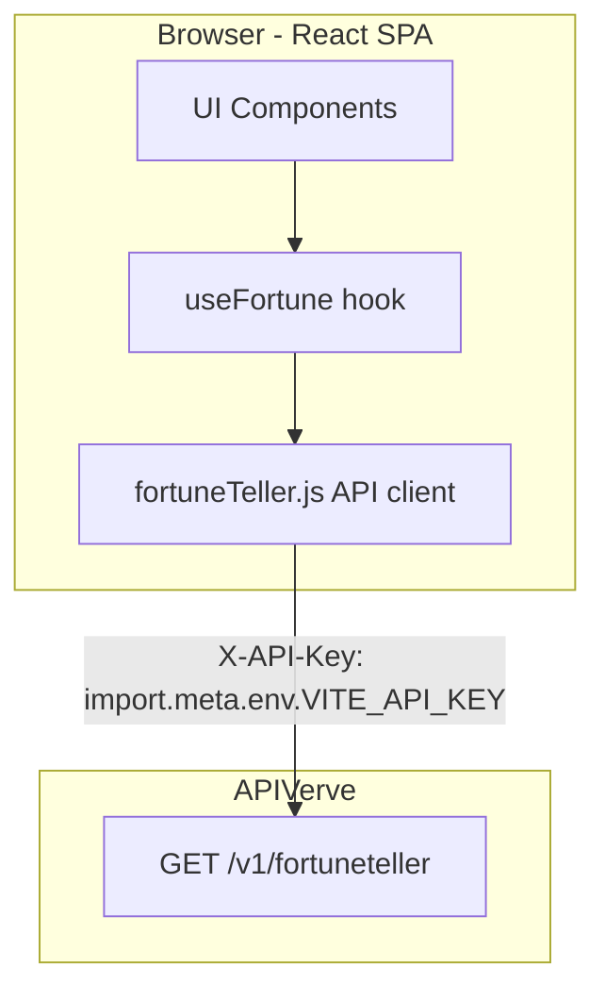
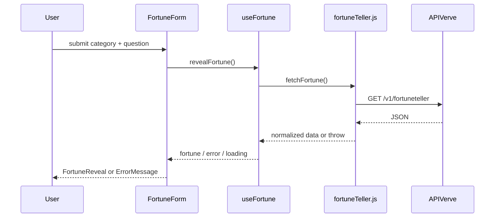

# AI Fortune Teller — Project Plan

## 1. Project overview

A single-page React app that asks APIVerve’s Fortune Teller API for AI-generated mystical fortunes. Users pick a life category, optionally ask a question, and receive a fortune with insight, timeframe, and lucky details.

**v1 scope:** Browser-only SPA, direct API calls (CORS supported), no backend.

## 2. Tech stack

| Layer | Choice |
|-------|--------|
| Build | Vite 8 |
| UI | React 19 |
| Styling | Tailwind CSS v4 (utilities in components; `@theme` in `index.css`) |
| API | APIVerve Fortune Teller REST |
| Config | `VITE_API_KEY` in `.env` |

## 3. Architecture



| Layer | Responsibility |
|-------|----------------|
| **UI** | Category + question input, loading/reveal UX, fortune display |
| **`useFortune`** | Form state, validation, fetch lifecycle, error mapping |
| **`src/api/fortuneTeller.js`** | Build URL, headers, parse JSON, normalize errors |
| **APIVerve** | AI-generated fortune + lucky metadata |

**Design principles:** single-page app, no backend for v1, minimal dependencies.

## 4. API integration

### Primary — REST Fortune Teller (v1)

| Item | Value |
|------|--------|
| **Method** | `GET` |
| **URL** | `https://api.apiverve.com/v1/fortuneteller` |
| **Auth** | Header `X-API-Key: <VITE_API_KEY>` |
| **Optional headers** | `Accept: application/json`, `Content-Type: application/json` |
| **Cost** | 5 credits per call |
| **Latency** | ~2.5–5s typical |

**Query parameters**

| Param | Required | Values / limits |
|-------|----------|-----------------|
| `category` | No (default `general`) | `general`, `love`, `career`, `health`, `wealth`, `travel` |
| `question` | No | Max 500 characters; URL-encoded |

**Example request**

```
GET https://api.apiverve.com/v1/fortuneteller?category=love&question=Will%20I%20find%20harmony%20this%20year%3F
Headers: X-API-Key: ${import.meta.env.VITE_API_KEY}
```

**Success response shape**

```json
{
  "status": "ok",
  "error": null,
  "data": {
    "fortune": "...",
    "insight": "...",
    "timeframe": "in the coming weeks",
    "category": "love",
    "question": "...",
    "luckyNumbers": [87, 10, 16, 83, 99, 34],
    "luckyElement": "Wood",
    "luckyColor": "Purple",
    "luckyDay": "Tuesday",
    "timestamp": "2025-12-16T22:23:31.796Z"
  }
}
```

**Error handling in client**

- HTTP non-2xx → surface status + body message if present
- `status: "error"` → use `error` string
- Network / timeout → user-friendly retry message
- Validate `question.length <= 500` before fetch

### Not used in v1

| Endpoint | Method | Notes |
|----------|--------|-------|
| `https://api.apiverve.com/v1/graphql` | `POST` | Optional future |
| Dashboard | — | [APIVerve dashboard](https://dashboard.apiverve.com/) for key management |

**Docs:** [Fortune Teller API](https://docs.apiverve.com/ref/fortuneteller)

## 5. Project structure

```
src/
  api/
    fortuneTeller.js
  hooks/
    useFortune.js
  components/
    Layout/
      AppShell.jsx
      Header.jsx
    Form/
      FortuneForm.jsx
      CategorySelect.jsx
      QuestionInput.jsx
      RevealButton.jsx
    Fortune/
      FortuneReveal.jsx
      FortuneCard.jsx
      InsightCard.jsx
      LuckyDetails.jsx
    Feedback/
      LoadingState.jsx
      ErrorMessage.jsx
  App.jsx
  index.css
  lib/revealClasses.js
  main.jsx
```

## 6. UI components

### Layout

| Component | Purpose |
|-----------|---------|
| **AppShell** | Full-viewport layout, mystical background, centers content |
| **Header** | Title, tagline |

### Input / interaction

| Component | Purpose |
|-----------|---------|
| **FortuneForm** | Category + question + submit; disables while loading |
| **CategorySelect** | Pill buttons for 6 categories |
| **QuestionInput** | Optional textarea, 500 char max, category placeholders |
| **RevealButton** | Primary CTA with spinner when loading |

### Output

| Component | Purpose |
|-----------|---------|
| **FortuneReveal** | Orchestrates result sections with staggered reveal |
| **FortuneCard** | Main fortune + timeframe + category badge |
| **InsightCard** | Secondary insight panel |
| **LuckyDetails** | Numbers, color swatch, element, day |

### Feedback

| Component | Purpose |
|-----------|---------|
| **LoadingState** | “Consulting the stars…” during API wait |
| **ErrorMessage** | Dismissible error banner |

## 7. User flows

1. User picks category (default `general`) and optionally types a question.
2. Clicks **Reveal my fortune** → loading state shown.
3. On success → fortune, insight, and lucky details animate in; form stays for “Ask again”.
4. On error → error banner; form values preserved.



## 8. Environment variables

| Variable | Required | Description |
|----------|----------|-------------|
| `VITE_API_KEY` | Yes | APIVerve API key (`apv_…`) |

Copy `.env.example` to `.env` and set your key from the [APIVerve dashboard](https://dashboard.apiverve.com/).

## 9. Security notes

- API key is read via `import.meta.env.VITE_API_KEY` only in the API client.
- `.env` is gitignored; never commit secrets.
- Direct browser calls expose the key in the bundle — acceptable for personal/local use; use a proxy and rotate keys if the repo is public.

## 10. Future enhancements

- GraphQL batching via `POST /v1/graphql`
- Fortune history in `localStorage`
- Shareable fortune card image
- Optional Vite proxy to hide API key in production
